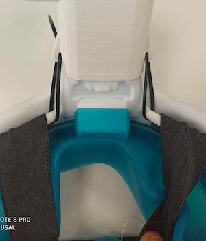
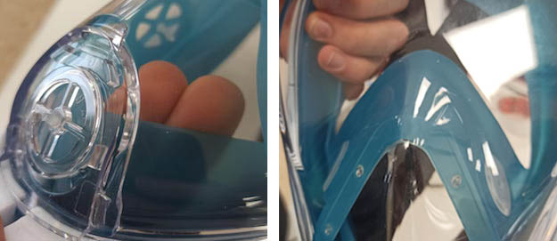

# Acople de máscara de emergencia para ventiladores

La máscara de snorkel de superficie Easybreath fue propuesta por [isinnova.it](https://www.isinnova.it/easy-covid19-eng/) para hacer frente a la posible escasez de mascarillas hospitalarias. El inventor Dr. Favero desarrolló un nuevo componente para la conexión con el respirador, que se denominó válvula Charlotte. En este repositorio se encuentran las modificaciones, que partiendo de la pieza original, se han realizado con el fin de mejorar su fabricación y funcionalidad. Ni la máscara ni la conexión de la válvula tienen la certificación necesaria y su uso está supeditado a una situación de necesidad urgente. Las modificaciones y trabajos que a continuación se documentan no están ligadas a ninguna institución, entidad o actividad económica y son trabajos que se enmarcan enteramente dentro de las activiadades de investigación y desarrollo ejercidas por las personas que se encuentran reflejadas en el documento. Esta información ha sido compartida para mejorar la divulgación de los distintos estudios realizados y la busqueda de pontenciales aplicaciones en el futuro.

Se han desarrollado dos variantes del modelo original. La primera es una variante (Charlotte) que principalmente mejora el acoplamiento, pero intercambia las entradas y salidas, mientras que la segunda versión (llamada Isabel en honor a la doctora Isabel Muñoz) consigue mejores y más balanceados flujos de entrada de aire y elimina algunos de los problemas de fabricación en impresoras 3D. Ambas variantes mantienen el mismo sistema de anclaje y sellado con la mascara del Decathlon, pero el modelode 

Los cambios realizados han sido pensados para el uso del dispositivo en determinados tipos de pacientes. Para información sobre las ideas originales y potenciales usos del sistema dirigirse a [@Juan Luis Nicolás Barbajero](https://www.facebook.com/SEDATIO). Para información sobre los sistemas de fabricación y diseño de la adapcación tecnológica dirigirse a [@Andrés Sanz García](https://github.com/mugiro). Ganaremos y con vuestra ayuda, antes y mejor.

## Diferencias con los esquemas de montaje originales

El esquema inicial descargado de la pagina de [Isinnova](https://www.3dprintingmedia.network/forums/topic/charlotte-valve-by-isinnova-for-non-invasive-ventilator/) utilizaba las vías laterales de la mascara como elementos de salida y la vía central como elemento de entrada, tal y como se muestra en la siguiente figura:

    

Sin embargo, y como se menciona en el punto anterior, el esquema actual intercambia dichos canales para ganar área de entrada. El nuevo esquema de circulación de flujo es el siguiente:

    

## Modelo propuesto 1. Válvula de Charlotte modificada

    

Los principales cambios son los siguientes:
* **Estanqueidad**: Mejora de las estanqueidades por rediseño de la conexión, mayor ajuste con la goma tórica. Se insertan dos orejas que pueden ser utilizadas para apretar la conexión contra la junta tórica.
* **Orden conexiones**: Cambio de las conexiones de entrada y salida para facilitar la entrada de oxigeno en la parte inferior y reducir el volumen de la mascara.
* **Área de entrada**: La línea de la válvula PEEP (salida) será de un área total de 214 mm2.
* **Área de salida**: La línea de entrada del flujo oxígeno será la entrada curva con un área total de 424 mm2.
* **Valvulas interiores**: Importante!!! Cambio de posición de todas las válvulas de la máscara de buceo!!! Esto se realiza para permitir la salida del CO2 exhalado hacia la zona superior (de los ojos) y realizar una evacuación por la parte superior de la frente (canal central de la válvula).
* **Resistencia**: Rediseño y refuerzos de la estructura de la válvula mediante mayores grosores de pared.
* **Geometría**: Rediseño de curvas internas para mejorar el ajuste y la calidad de la impresión 3D de la pieza.
* **Cierre interior**: Se añade adhesivo en paredes interiores de la geometría cuadrada interior, para mejorar estanqueidad y mayor rigidez.
* **Sistema de agarre**: Eliminación de la pestaña de agarre y sustitución por un anclaje con bridas en los laterales de la valvula Charlotte.

## Modelo propuesto 2. Nuevo modelo con entrada balanceada de aire

    

Aparte de las mejoras logradas en la primera modificación, las principales nuevas mejoras de la valvula Isabel son las siguientes:

* **Estanqueidad**: Mejoras en el sellado del tubo de salida interior. 
* **Flujos de aire en el canal de entrada**: El canal de entrada permite introducir el flujo de aire de forma balanceada entre las dos zonas de la máscara y elimina los puntos de resistencia cinematica al aire. 
* **Tiempo de fabricación**: Tiempos de fabricación más cortos.

## Archivos STEP y STL

### Modelo propuesto 1: valvula Charlotte modificada
[Descarga STEP v.3](step/charlotte_valve_v3.stp)

[Descarga STL v.3](stl/charlotte_valve_v3.stl)

### Modelo propuesto 2: nueva versión Isabel  
[Descarga STEP v.4](step/charlotte_isabel_v4.stp)

[Descarga STL v.4](stl/charlotte_isabel_v4.stl)

## Instrucciones de montaje

En primer lugar se recomienda utilizar algun tipo de sellado en la parte interior en la sección cuadrada para mejorar la estanqueidad del sistema y evitar el intercambio de flujos entre entradas y saludas, justo en la junta de encuentro.

    

La conexión del tubo con la mascara se ha ajustado para encajar en frío por presión simple ejercida siguiendo las instrucciones contenidas en el siguiente video:

Esta operación hace que el conector de PLA presione la junta tórica y reduce drásticamente las posibles fugas en la unión. Es muy importante que el sistema encaje sin holguras y hemos detectados bastantes variaciones dimencionales entre las mascaras de un mismo modelo. En el caso de que el conector se quede atascado a la altura de la junta tórica, debemos presionar sobre ella manualmente con un destornilador fino o herramienta similar, para que el conector no pinze la junta tórica. 

Un cambio sobre el modelo inicial es la eliminación de las pestaña superiores que anclaba el conector Charlotte durante el montaje. Aunque más sencillo que nuestra propuesta, creemos que hemos conseguido un sistema más robusto, donde el número de roturas es practicamente cero si la pieza está correctamente impresa. Así pues, y para evitar que la conexión pierda estanqueidad el tiempo que está siendo utilizado el dispositivo por el paciente, se ha recurrido a un sistema de anclaje con bridas que mantiene la tensión siempre sobre la junta tórica y evita movimientos laterales que incrementen la holgura por deformación del PLA. Se han utilizado bridas de 150 x 2.5 mm de poliamida/nylon.

    

Finalmente, y siguiendo el esquema inicial propuesto, se ha de girar todas y cada una de las válvulas de la máscara. Se incluyen fotos con la con las posiciones finales de las mismas a continuación:

    

Una vez se finaliza su uso, para remover la valvula de la mascara, basta con cortar las bridas y aplicar calor sobre la válvula. El PLA pierde rigidez y se deforma facilmente a partir de los 60ºC, permitiendo su fácil extracción.
Es importante remarcar que el componente impreso es de un solo uso y ha de ser descartado como residuo biológico infeccioso. 

## Videos de las pruebas de montaje realizadas

A continuación se muestran los videos de las pruebas de montaje realizadas.
* **Montaje inicial con STL de origen**: [Link](https://www.facebook.com/SEDATIO/videos/2777854718995304 "Link");  [Descarga](video/test_initial.mp4)

* **Montaje final con STL modificado**:[Link](https://www.facebook.com/SEDATIO/videos/2785598748220901 "Link");  [Descarga](video/test_final.mp4)

* **Explicación montaje de valvula Charlotte modificada**:

## Prototipado mediante impresión 3D

* **3D Printer**: Prusa MK3s

### Parámetros de impresión

* **Filament**: PLA filament 1.75 mm
* **Nozzle temperature**: 215 – 217 ° C
* **Builtplate temperature**: 60 ° C
* **Layer thickness**: 0.2 mm
* **Add. notes**: The supports are only touching the builtplate.

    

## Contactos

* **Armando González Muñoz** - Spain - [@armandopeska](https://github.com/armandopeska)
* **Juan Luis Nicolás Barbajero** - Spain - [@JuanLuis](https://www.facebook.com/SEDATIO)
* **Andres Sanz Garcia** - Spain - [@mugiro](https://github.com/mugiro)

## Other information

Print impressions of the Charlotte valve By Jan Sebastian van Ackeren and Jerry de Vos. [Ackeren](https://docs.google.com/document/d/1nmjyFOHmBbaKG4P3CZGqO-naOPvYvfRFZUZONSgWS88/edit)

File Source: Charlotte Valve by Isinnova for non-invasive [Isinnova](https://www.3dprintingmedia.network/forums/topic/charlotte-valve-by-isinnova-for-non-invasive-ventilator/)
