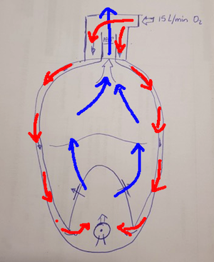
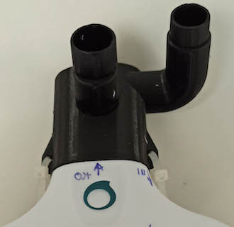
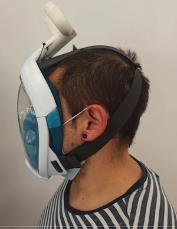
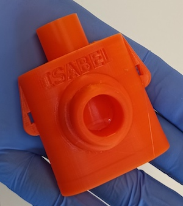

# Acople de máscara de emergencia para ventiladores

La máscara de snorkel de superficie Easybreath fue propuesta por [isinnova.it](https://www.isinnova.it/easy-covid19-eng/) para hacer frente a la posible escasez de mascarillas hospitalarias. El inventor Dr. Favero desarrolló un nuevo componente para la conexión con el respirador, que se denominó válvula Charlotte. En este repositorio se encuentran las modificaciones, que partiendo de la pieza original, se han realizado con el fin de mejorar su fabricación y funcionalidad. Ni la máscara ni la conexión de la válvula tienen la certificación necesaria y su uso está supeditado a una situación de necesidad urgente. Las modificaciones y trabajos que a continuación se documentan no están ligadas a ninguna institución, entidad o actividad económica y son trabajos que se enmarcan enteramente dentro de las activiadades de investigación y desarrollo ejercidas por las personas que se encuentran reflejadas en el documento. Esta información ha sido compartida para mejorar la divulgación de los distintos estudios realizados y la busqueda de pontenciales aplicaciones en el futuro.

Se han desarrollado dos variantes del modelo original. La primera es una variante (Charlotte) que principalmente mejora el acoplamiento, pero intercambia las entradas y salidas, mientras que la segunda versión (llamada Isabel en honor a la doctora Isabel Muñoz) consigue mejores y más balanceados flujos de entrada de aire y elimina algunos de los problemas de fabricación en impresoras 3D. Ambas variantes mantienen el mismo sistema de anclaje y sellado con la mascara del Decathlon, pero el modelode 

Los cambios realizados han sido pensados para el uso del dispositivo en determinados tipos de pacientes. Para información sobre las ideas originales y potenciales usos del sistema dirigirse a [@Juan Luis Nicolás Barbajero](https://www.facebook.com/SEDATIO). Para información sobre los sistemas de fabricación y diseño de la adapcación tecnológica dirigirse a [@Andrés Sanz García](https://github.com/mugiro). Ganaremos y con vuestra ayuda, antes y mejor.

## Diferencias en los esquemas de montaje

El esquema inicial descargado de la pagina de [Isinnova](https://www.3dprintingmedia.network/forums/topic/charlotte-valve-by-isinnova-for-non-invasive-ventilator/) utilizaba las vías laterales de la mascara como elementos de salida y la vía central como elemento de entrada, tal y 

Como se menciona en el punto anterior, el esquema actual<z> intercambia dichos canales para ganar área de entrada, y se sacrifica el área a la salida de la válvula PEEP:

## Modelo 1. Válvula de Charlotte modificada

Los principales cambios son los siguientes:
* **Estanqueidad**: Mejora de las estanqueidades por rediseño de la conexión, mayor ajuste con la goma tórica. Se insertan dos orejas que pueden ser utilizadas para apretar la conexión contra la junta tórica.
* **Orden conexiones**: Cambio de las conexiones de entrada y salida para facilitar la entrada de oxigeno en la parte inferior y reducir el volumen de la mascara.
* **Área de entrada**: La línea de la válvula PEEP (salida) será de un área total de 214 mm2.
* **Área de salida**: La línea de entrada del flujo oxígeno será la entrada curva con un área total de 424 mm2.
* **Valvulas interiores**: Importante!!! Cambio de posición de todas las válvulas de la máscara de buceo!!! Esto se realiza para permitir la salida del CO2 exhalado hacia la zona superior (de los ojos) y realizar una evacuación por la parte superior de la frente (canal central de la válvula).
* **Resistencia**: Rediseño y refuerzos de la estructura de la válvula mediante mayores grosores de pared.
* **Geometría**: Rediseño de curvas internas para mejorar el ajuste y la calidad de la impresión 3D de la pieza.
* **Cierre interior**: Se añade adhesivo en paredes interiores de la geometría cuadrada interior, para mejorar estanqueidad y mayor rigidez.
* **Sistema de agarre**: Eliminación de la pestaña de agarre y sustitución por un anclaje con bridas en los laterales de la valvula Charlotte.

## Modelo 2. Nuevo modelo con entrada balanceada de aire

Las principales mejoras son las siguientes:

* **Estanqueidad**: Mejoras en el sellado del tubo de salida interior. 
* **Canal de entrada**: El canal de entrada permite introducir el flujo de aire de forma balanceada entre las dos zonas de la máscara y elimina los puntos de resistencia cinematica al aire. 
* **Tiempo de fabricación**: Tiempo de fabricación más cortos.

## Instrucciones de montaje de ambas versiones

La conexión del tubo con la mascara se ha ajustado para encajar por presión. (video montaje). Esto hace que el PLA presione la junta tórica y elimina las posibles fugas en la unión. Importante: este sistema también parece ser una solución a los problemas por las variaciones dimensionales en las mascaras y las impresiones 3D.

Se recomienda utilizar algun tipo de sellado en la parte interior en la sección cuadrada para mejorar la estanqueidad del sistema.

Para evitar que la conexión pierda estanqueidad, y debido a las continuas roturas de las pestañas superiores durante el montaje, se ha recurrido a un sistema de anclaje con bridas que mantiene la tensión siempre sobre la junta tórica y evita movimientos laterales. Se han utilizado bridas de 150 x 2.5 mm de poliamida/nylon.

En el esquema propuesto, se ha de girar todas y cada una de las válvulas de la máscara. Se incluyen fotos con la posición y final

## Fotos de acabado

A continuación se muestran las fotos del montaje final. 

Vista de detalle del montaje con el ajuste manteniendo la presión con las bridas.

## Videos de las pruebas realizadas

A continuación se muestran los videos de las pruebas realizadas.
* **Montaje inicial con STL de origen** [Montaje inicial](https://www.facebook.com/SEDATIO/videos/2777854718995304 "Montaje inicial")

[Descarga video montaje inicial](video/test_initial.mp4)

* **Montaje final con STL modificado**:[Montaje final](https://www.facebook.com/SEDATIO/videos/2785598748220901 "Montaje final")

[Descarga video montaje final](video/test_final.mp4)

## Archivos STL. 
### Archivo STL. Versión Charlotte modificada

[Descarga archivo STL v.3](stl/charlotte_valve_v3.stl)
test_final_2

### Archivo STL. Versión Isabel

[Descarga archivo STL v.4](stl/charlotte_isabel_v4.stl)

## Impresión 3D

* **3D Printer**: Prusa MK3s

### Printing settings

* **Filament**: PLA filament 1.75 mm
* **Nozzle temperature**: 215 – 217 ° C
* **Builtplate temperature**: 60 ° C
* **Layer thickness**: 0.2 mm
* **Add. notes**: The supports are only touching the builtplate.

## Contactos

* **Armando González Muñoz** - Spain - [@armandopeska](https://github.com/armandopeska)
* **Juan Luis Nicolás Barbajero** - Spain - [@JuanLuis](https://www.facebook.com/SEDATIO)
* **Andres Sanz Garcia** - Spain - [@mugiro](https://github.com/mugiro)

## Other information

Print impressions of the Charlotte valve By Jan Sebastian van Ackeren and Jerry de Vos. [Ackeren](https://docs.google.com/document/d/1nmjyFOHmBbaKG4P3CZGqO-naOPvYvfRFZUZONSgWS88/edit)

File Source: Charlotte Valve by Isinnova for non-invasive [Isinnova](https://www.3dprintingmedia.network/forums/topic/charlotte-valve-by-isinnova-for-non-invasive-ventilator/)
